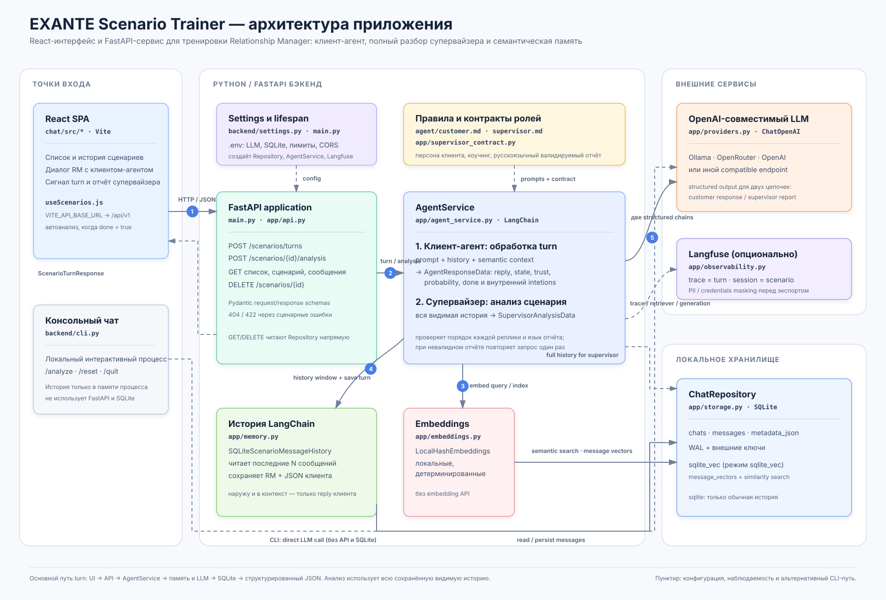

# Архитектура EXANTE Scenario Trainer

`EXANTE Scenario Trainer` — приложение для тренировки Relationship Manager (RM) в сценарном диалоге. RM ведёт разговор с моделируемым потенциальным клиентом EXANTE, а приложение возвращает реплику клиента и оценочный сигнал. Отдельно можно запросить полный разбор диалога супервайзером.

Схема показывает веб-приложение, FastAPI-бэкенд и внешние зависимости. Пунктиром отмечены конфигурационные, наблюдательные и альтернативные CLI-связи.

## Точки входа

### React SPA

Клиент находится в `chat/` и собирается Vite. Хук `chat/src/hooks/useScenarios.js` управляет списком сценариев, загрузкой истории, отправкой реплик, удалением сценариев и запросом отчёта супервайзера.

По умолчанию UI обращается к `http://127.0.0.1:8000/api/v1`; адрес можно изменить через `VITE_API_BASE_URL`. После turn с `agent_response.done = true` интерфейс автоматически запрашивает анализ сценария.

### Консольный чат

`backend/cli.py` — независимый интерактивный путь для разработки и ручной проверки промптов. Он вызывает LLM напрямую, хранит историю только в памяти процесса и не использует FastAPI, SQLite или Langfuse. Команда `/analyze` запускает анализ супервайзера для текущей истории.

## FastAPI и API

`backend/main.py` создаёт приложение, настраивает CORS и в `lifespan` инициализирует `ChatRepository`, Langfuse-клиент и `AgentService`. Роуты определены в `backend/app/api.py`.

| Маршрут | Назначение |
| --- | --- |
| `POST /api/v1/scenarios/turns` | Создать сценарий или обработать следующую реплику RM. |
| `POST /api/v1/scenarios/{id}/analysis` | Получить полный структурированный отчёт супервайзера. |
| `GET /api/v1/scenarios` | Получить список сценариев. |
| `GET /api/v1/scenarios/{id}` | Получить один сценарий. |
| `GET /api/v1/scenarios/{id}/messages` | Получить видимую историю диалога. |
| `DELETE /api/v1/scenarios/{id}` | Удалить сценарий вместе с сообщениями. |
| `GET /api/v1/health` | Проверить доступность и режим хранилища. |

Маршруты чтения и удаления обращаются к репозиторию напрямую. Обработка turn и анализ передаются в `AgentService`.

## AgentService: два сценария LLM

`backend/app/agent_service.py` создаёт один OpenAI-совместимый chat model и две LangChain-цепочки со структурированным выводом.

### 1. Ответ клиентского агента

Для `POST /scenarios/turns` сервис:

1. Создаёт сценарий или проверяет существующий.
2. Загружает последнее окно сообщений и, в режиме `sqlite_vec`, извлекает релевантные ранние сообщения семантическим поиском.
3. Формирует промпт из профиля клиента (`backend/agent/customer.md`), semantic context, истории и новой реплики RM.
4. Вызывает LLM и валидирует `AgentResponseData`.
5. Сохраняет реплику RM и полный JSON-ответ клиентского агента в SQLite.
6. Возвращает API видимую реплику клиента, оценочный сигнал и метаданные turn.

`AgentResponseData` содержит `reply`, `intetions`, `state`, `trust`, `purchase_probability` и `done`. Поле `reply` доступно в истории и UI; остальные поля являются оценочным сигналом turn. Полный JSON сохраняется, чтобы состояние можно было обработать при дальнейшем использовании, однако API не выдаёт его как текст сообщения.

### 2. Анализ супервайзера

Для `POST /scenarios/{id}/analysis` сервис берёт всю сохранённую видимую историю, а не только history window. Он объединяет правила из `backend/agent/supervisor.md`, профиль клиента и контракт из `app/supervisor_contract.py`, затем получает `SupervisorAnalysisData`.

Отчёт содержит итоговую оценку RM, разбор каждой реплики в исходном порядке и приоритетные рекомендации. Результат дополнительно проверяется: должны присутствовать все реплики, порядок и говорящий должны совпадать с историей, а текст отчёта должен быть на русском. При невалидном ответе выполняется один повторный запрос с усиленным контрактом.

## Промпты и контракты

- `backend/agent/customer.md` задаёт персону и правила поведения моделируемого клиента.
- `backend/agent/supervisor.md` задаёт роль и методику коучинга супервайзера.
- `backend/app/supervisor_contract.py` содержит машиночитаемые требования к полноте, порядку и языку отчёта.
- `backend/app/schemas.py` описывает Pydantic-модели входных и выходных данных API и структурированных ответов LLM.

## Память и локальное хранилище

`ChatRepository` из `backend/app/storage.py` хранит сценарии и сообщения в SQLite. База содержит таблицы `chats` и `messages`; для неё включены внешние ключи и WAL. Сообщения содержат роль, время и JSON-метаданные.

`SQLiteScenarioMessageHistory` из `backend/app/memory.py` адаптирует хранилище к интерфейсу LangChain. Он загружает ограниченное настройкой окно сообщений и сохраняет пару сообщений одного turn. Для ответа ассистента он извлекает и передаёт в последующий контекст только видимый `reply` клиента.

### Режимы памяти

| `CHAT_CHAT_STORAGE_MODE` | Поведение |
| --- | --- |
| `sqlite` | Только обычная SQLite-история; семантический поиск выключен. |
| `sqlite_vec` | Дополнительно создаётся `message_vectors`, а релевантные сообщения выбираются через `sqlite-vec`. |

`LocalHashEmbeddings` из `backend/app/embeddings.py` строит детерминированные локальные векторы, поэтому семантическая память не требует отдельного embedding API. Для production её можно заменить на более качественную модель эмбеддингов.

## LLM-провайдер

`backend/app/providers.py` создаёт `ChatOpenAI` из `langchain-openai`. Клиент работает с любым OpenAI-совместимым endpoint: локальным Ollama, OpenRouter, OpenAI или другим совместимым сервисом.

Основные параметры считываются из `backend/.env` с префиксом `CHAT_`:

- `CHAT_LLM_MODEL`, `CHAT_LLM_BASE_URL`, `CHAT_LLM_API_KEY`;
- `CHAT_LLM_TEMPERATURE`, `CHAT_LLM_TIMEOUT_SECONDS`;
- `CHAT_SQLITE_PATH`, `CHAT_CHAT_STORAGE_MODE`;
- размеры окна истории, семантической памяти и вектора.

Полный пример конфигурации приведён в `backend/.env.example` и [README](README.md).

## Наблюдаемость: Langfuse

Langfuse включается только при наличии `LANGFUSE_PUBLIC_KEY` и `LANGFUSE_SECRET_KEY` и если `LANGFUSE_TRACING_ENABLED` не выключен. Для каждого API turn создаётся trace, а `scenario.id` служит `session_id`; внутри фиксируются наблюдение агента, semantic retriever и LangChain generation.

Перед экспортом в Langfuse `backend/app/observability.py` маскирует распространённые email-адреса, номера телефонов, карт и credential-пары. Это защитный минимум, а не замена требованиям к обработке персональных данных.

## Основные потоки

### Обработка реплики RM

`React SPA → FastAPI → AgentService → history / semantic memory → LLM → SQLite → ScenarioTurnResponse → React SPA`

### Полный разбор

`React SPA → FastAPI → AgentService → вся видимая история SQLite + supervisor contract → LLM → SupervisorAnalysisData → React SPA`

